### github的使用

github网址：[GitHub · Build and ship software on a single, collaborative platform · GitHub](https://github.com/)

点击Sign up注册账号（填写邮箱、密码、用户名等信息），会有一个小游戏验证是否为真人，然后是邮箱验证，验证通过后就注册成功啦！

点击这两个地方（任选一个即可），创建一个新的仓库。

- Add a README file：初始化一个 `README.md` 文件在你的仓库里。README 文件用于介绍你的项目，包括项目说明、用法、安装步骤等内容。在 GitHub 上，这个文件会自动显示在仓库主页的最下方，是很多开源项目的“门面”。
- Add .gitignore：添加 `.gitignore` 文件，用于定义哪些文件或文件夹不应该被 提交到仓库。在开发过程中，常有一些本地配置文件、缓存、编译生成的临时文件不需要同步到远程仓库，防止泄漏私密信息或污染代码库。
- Choose a license：为你的代码仓库选择一个开源许可证。License 文件说明其他人是否可以使用、怎么使用、修改、分发你的项目。没有 License，别人很难知道能不能合法使用。

根据自己的需求按照顺序，创建自己的仓库

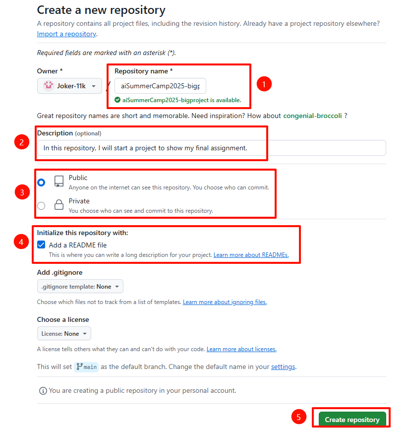

创建完成后，就会出现以下界面

邀请小组其他成员一起管理

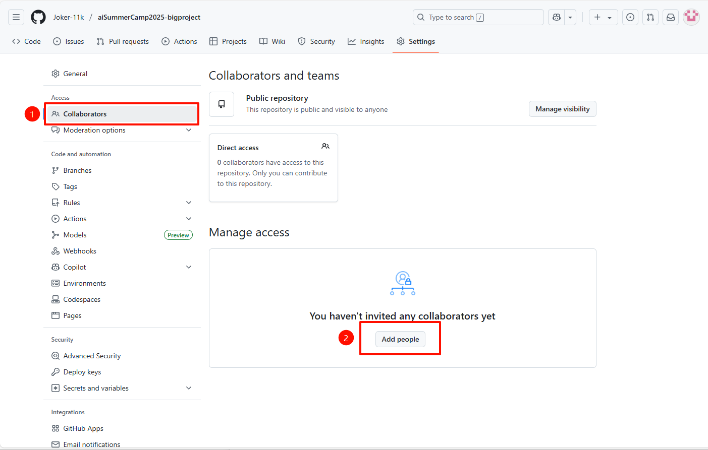

### git的使用

git网址：[Git](https://git-scm.com/)

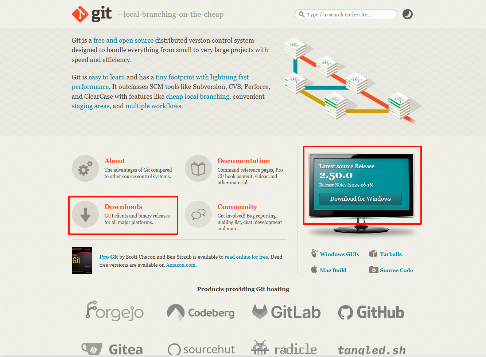

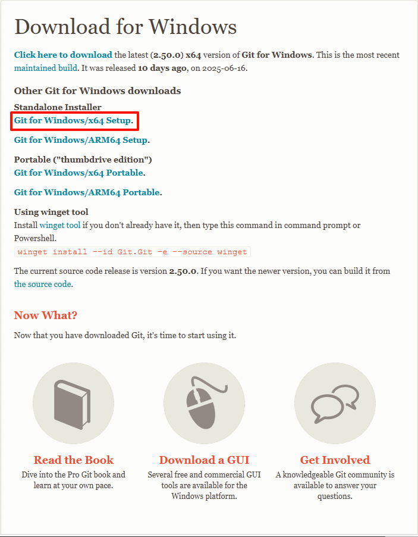

按照它的安装流程傻瓜式安装，选项保持默认即可。

git需要创建自己的账户，使用下面的命令（注意空格，要不然会创建不成功）创建用户名和邮箱地址，邮箱地址最好和gitlab和github注册的邮箱地址相同。

git config --global user.name "Your name"

git config --global user.email "Your email"

创建完成后，输入命令git config --list，就可以看见创建的信息，如下图所示。

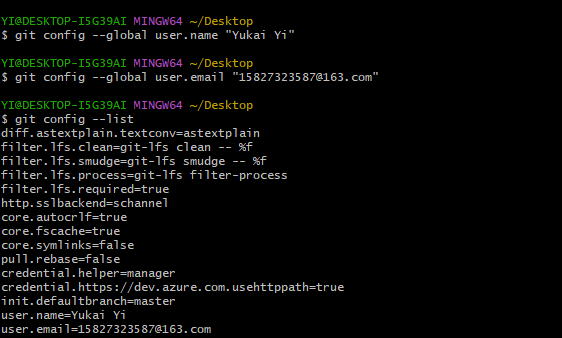

输入命令ssh-keygen -t rsa -C"Your email"（最好和之前注册的邮箱相同），直接键盘上点enter就可以（需要点三次）。

可以在.ssh中看见两个文件，我们打开id_rsa.pub这个文件（可以使用vs code打开），里面是以ssh-rsa开头密钥。

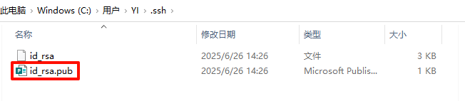

然后我们打开github网站，按照顺序打开Settings--SSH and GPG keys--New SSH Key

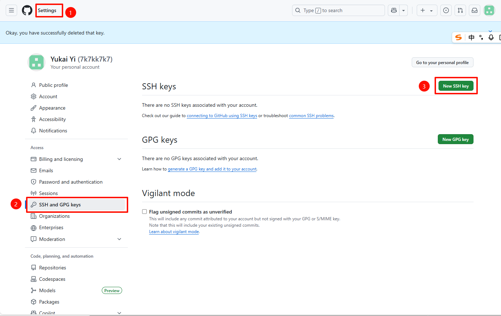

将上面复制的密钥粘贴，Title自定义。

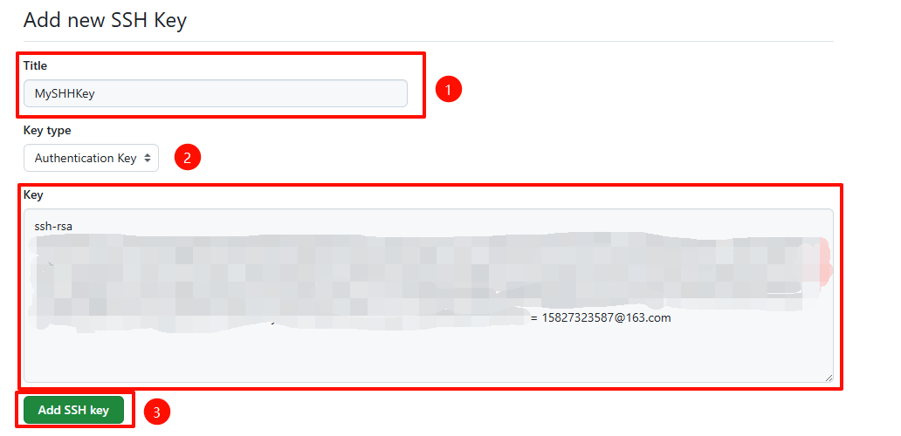

测试SSH是否好用

ssh -T git@github.com

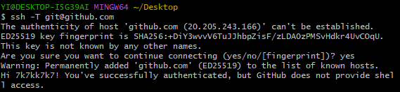

直接输入命令git

- 显示git命令的总览帮助文档
- 把常用的git子命令、辅助说明、使用格式都列出来，并提示如何获取更详细的帮助

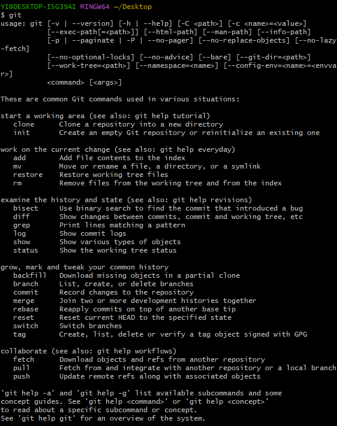

- clone：克隆一个远程仓库到本地，自动下载代码、分支、历史记录等。例：`git clone https://....git`
- init：本地初始化一个空仓库，新项目首次用git管理就用这个。例：`git init`
- add：把文件的内容添加到暂存区。例：`git add name.text`或`git add .`
- mv：移动或重命名文件（或目录等）。例：`git mv oldname.txt newname.txt`或`git mv ./dir1/file.txt ./dir2/`
- restore：撤销工作区或暂存区的改动，将文件恢复到某个之前的状态。例：`git restore name.txt`或`git restore --staged name.txt`
- rm：将文件从工作区和暂存区删除。例：`git rm name.txt`或`git rm --cached name.txt`
- commit：将已经 `git add` 到暂存区的文件，保存到你的本地仓库中，形成一个新的版本记录。例：`git commit -m "本次提交的说明"`
- fetch：从远程仓库获取最新的分支、标签信息等你的本地仓库，但不会自动合并和修改。例：`git fetch`
- pull：从远程仓库下载最新的历史记录并自动尝试合并到你当前所在的本地分支（会同时更新你的本地仓库和工作区）。例：`git fetch`
- push：将本地分支上的提交上传到远程仓库。例`git push -u origin master`

找到要上传的文件夹，鼠标右键选择Open Git Bsah here，输入git init

它会在当前目录下创建一个名为 `.git` 的隐藏文件夹，有了这个文件夹就可以使用各种命令去管理文件。

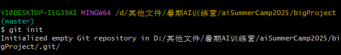

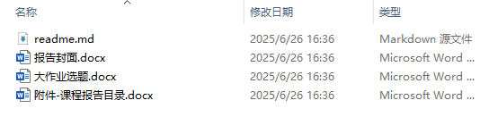

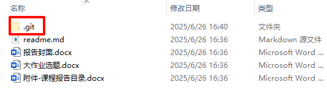

输入git add .命令 

- 将当前目录及其子目录下所有有变动的文件（包括新建、修改、删除的文件）全部添加到暂存区，准备提交
- 也可以写更具体的文件名，比如git add readme.md，只加这一个文件。

输入git commit -m "first commit"命令

- 把已经添加到暂存区的更改，生成一个快照，永久保存到你的本地git仓库的历史记录中
- “ ”中的内容是本次提交的信息注释，可以写成自己需要的内容

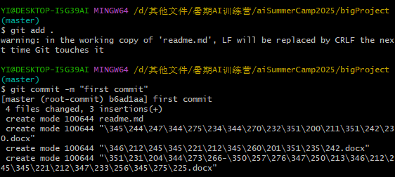

找到远程仓库的SSH，输入命令git remote add origin 远程仓库的URL

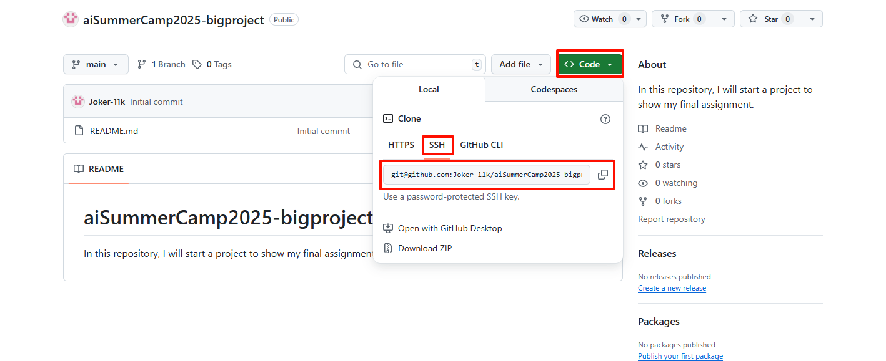

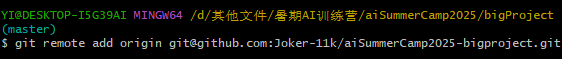

输入git remote -v，可以查看配置远程仓库的URL

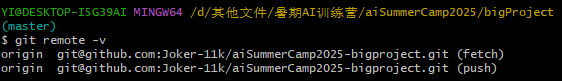

最后是推送指令，推送到指定仓库的master分支下

git push -u origin master

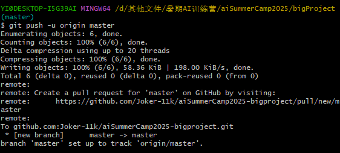

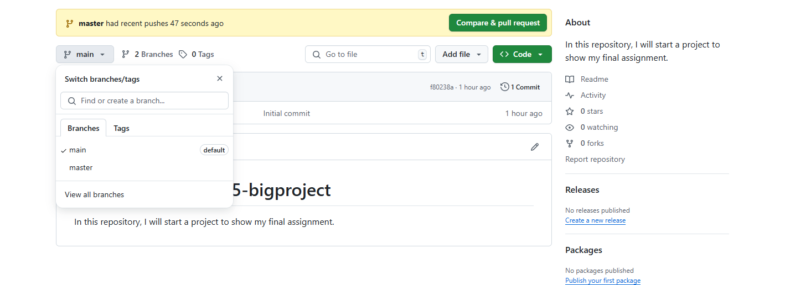

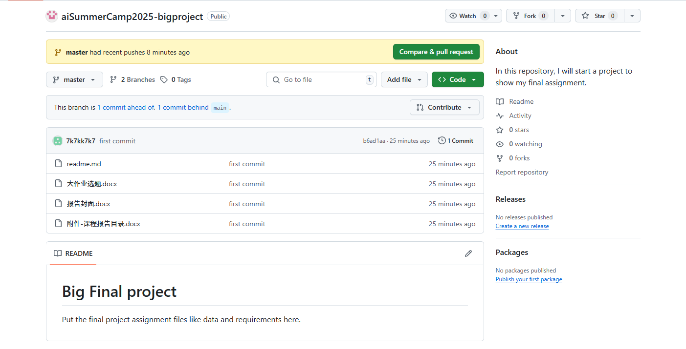

如何查看提交的信息

- 最常用的是git log

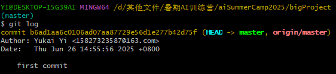

- 在仓库主页，点击Commit也可查看

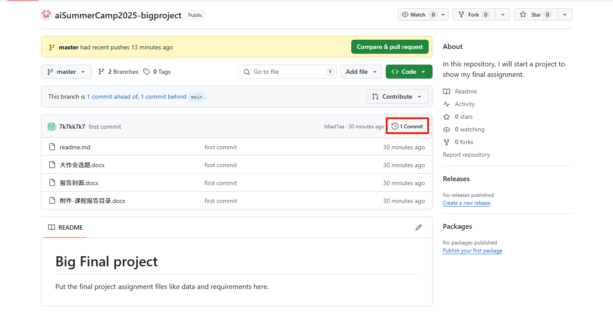

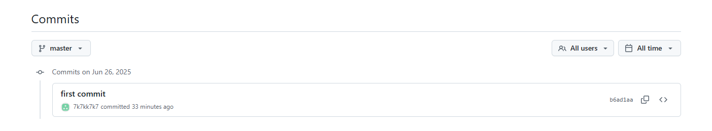

### Branch

分支就是你在项目中开辟出的“独立开发路线”，可以想象成“并行宇宙”，每个分支有各自的提交历史。

git fetch --all获取最新远程分支列表

查看分支的命令

- git branch：查看本地分支

- git branch -r：查看远程分支

- git branch -a：查看所有分支（本地+远程）

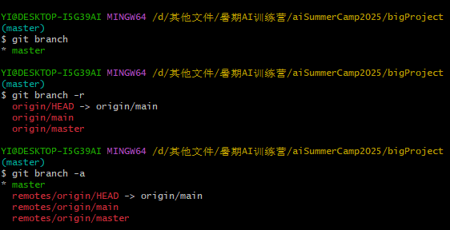

创建新的分支，git branch 新分支名，但是这个新分支只存在于本地仓库，需要使用命令git push origin 新分支名，这样github上才会出现这个分支。

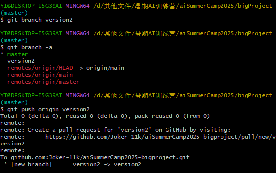

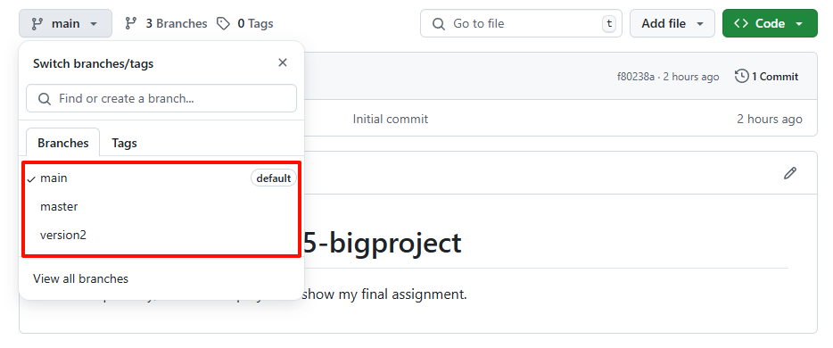

切换分支 git switch 要切换到分支名

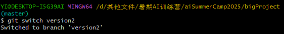

### github上有意思的库

#### 1. hello world

网址：[leachim6/hello-world: Hello world in every computer language. Thanks to everyone who contributes to this, make sure to see contributing.md for contribution instructions!](https://github.com/leachim6/hello-world)

学习很多语言都是从一个hello world！开始

#### 2. scikit-learn

网址：[scikit-learn/scikit-learn: scikit-learn: machine learning in Python](https://github.com/scikit-learn/scikit-learn)

#### 3. 小游戏

2048网址：[gabrielecirulli/2048: The source code for 2048](https://github.com/gabrielecirulli/2048#)

贪吃蛇网址：[CodeExplainedRepo/Snake-JavaScript: The Snake game, created using JavaScript, and The HTML5 canvas.](https://github.com/CodeExplainedRepo/Snake-JavaScript)

